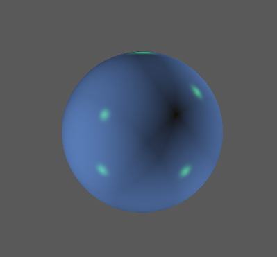
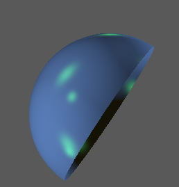
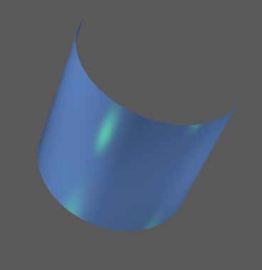
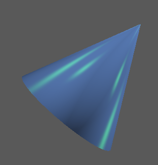
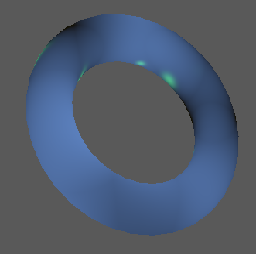
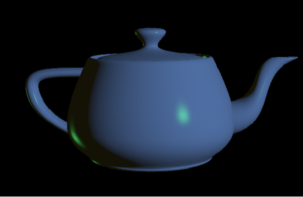

# GraphicsCollection
---
This is a small collection of Compute Graphics technique demo. It is adapted from [directx-sdk-samples](https://github.com/walbourn/directx-sdk-samples).
I keep the project name unchanged if it is adapted.

# Gallery

---

